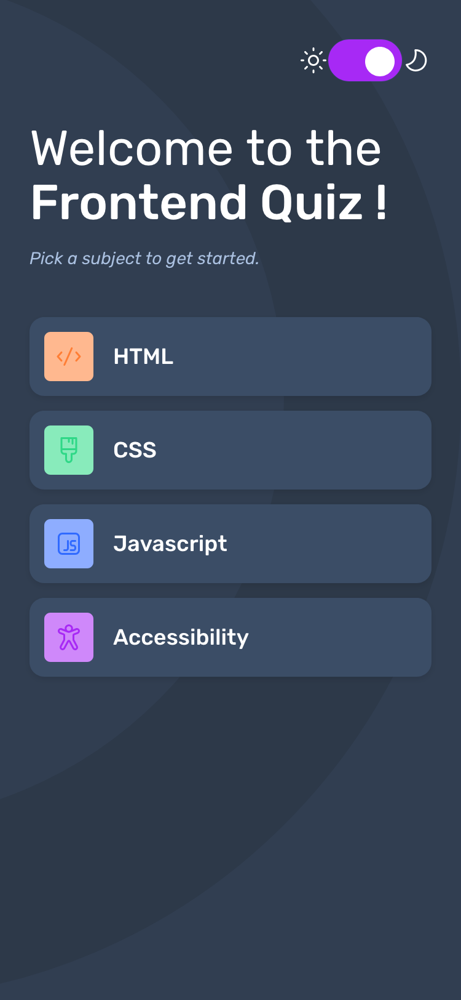
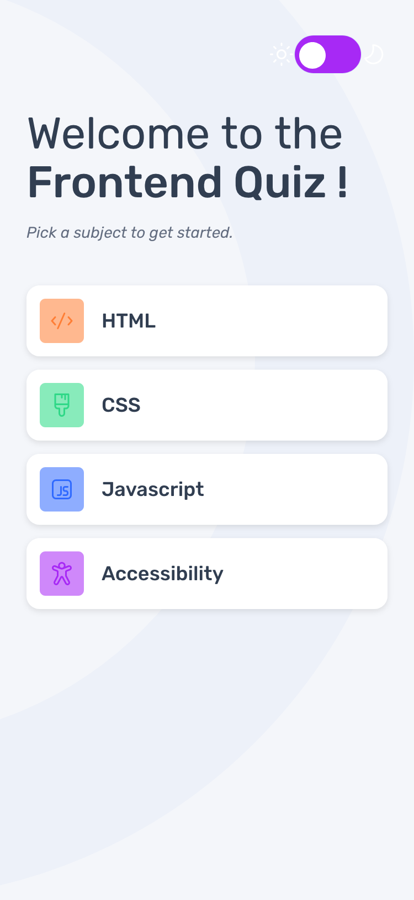
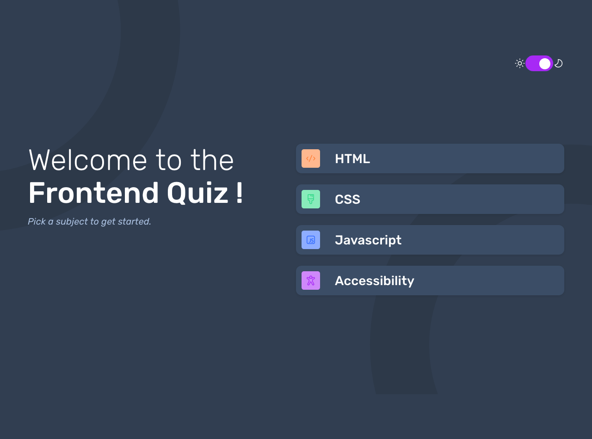

# Frontend Mentor - Frontend quiz app solution

This is a solution to the [Frontend quiz app challenge on Frontend Mentor](https://www.frontendmentor.io/challenges/frontend-quiz-app-BE7xkzXQnU). Frontend Mentor challenges help you improve your coding skills by building realistic projects. 

## Table of contents

- [Frontend Mentor - Frontend quiz app solution](#frontend-mentor---frontend-quiz-app-solution)
  - [Table of contents](#table-of-contents)
  - [Overview](#overview)
    - [The challenge](#the-challenge)
    - [Screenshot](#screenshot)
    - [Links](#links)
  - [My process](#my-process)
    - [Built with](#built-with)
    - [What I learned](#what-i-learned)
    - [Continued development](#continued-development)
    - [Useful resources](#useful-resources)
  - [Author](#author)

## Overview

### The challenge

Users should be able to:

- Select a quiz subject (HTML, CSS, JavaScript, or Accessibility)
- Select a single answer from each question from a choice of four
- See a disabled submit button when no answer is selected
- See if they have made a correct or incorrect choice when they submit an answer
- Move on to the next question after submitting an answer
- See a completed state with their score after the final question
- Play again to choose another subject
- View responsive layouts optimized for mobile, tablet and desktop screens
- See hover and focus states for all interactive elements
- Navigate the entire app using only a keyboard
- Toggle between light and dark themes

### Screenshot





### Links

- Solution URL: [Add solution URL here](https://your-solution-url.com)
- Live Site URL: [Add live site URL here](https://your-live-site-url.com)

## My process

### Built with

- React 18 with Vite
- CSS Modules for scoped styling
- CSS Custom Properties for theming
- Flexbox and CSS Grid for layouts
- Mobile-first responsive design
- Context API for theme management
- Semantic HTML5 markup
- ARIA attributes for accessibility
- CSS animations and transitions

### What I learned

- Implemented a theme toggle using React Context:

```jsx
export function ThemeToggle() {
  const id = useId();
  const { theme, toggleTheme } = useContext(ThemeContext);
  const isChecked = theme === "dark";

  return (
    <div className={styles.themeContainer}>
      <div>
        
      </div>
      <label htmlFor={id} className={styles.switch}>
        <input
          type="checkbox"
          onChange={toggleTheme}
          id={id}
          checked={isChecked}
          aria-label="Toggle dark mode"
          role="switch"
          aria-checked={isChecked}
        />
        <span className={`${styles.slider} ${styles.round}`}></span>
      </label>
      <div>
        
      </div>
    </div>
  );
}
```

### Continued development
Enhance Quiz Functionality:
- Add a feature to review incorrect answers after the quiz is completed.

Testing:
- Write unit tests for all components to ensure they work as expected.
- Implement end-to-end tests to cover the entire user flow.
  
Deployment:
- Deploy the application to a cloud service like Vercel or Netlify.
- Set up continuous integration and continuous deployment (CI/CD) for automated testing and deployment.

### Useful resources

- [React Documentation](https://react.dev/) - This helped me to understanding React concept and API. I really liked how the documentation explain key concepts and provide examples.

## Author

- Frontend Mentor - [@mayor-creator](https://www.frontendmentor.io/profile/mayor-creator)